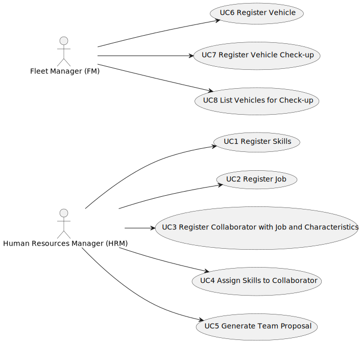

# Use Case Diagram (UCD)

**In the scope of this project, there is a direct relationship of _1 to 1_ between Use Cases (UC) and User Stories (US).**

However, be aware, this is a pedagogical simplification. On further projects and course units there may also exist _1 to N **and/or** N to 1_ relationships between UC and US.

**Use Case Diagram in a SVG format**

**For each UC/US, it must be provided evidences of applying main activities of the software development process (requirements, analysis, design, tests and code). Gather those evidences on a separate file for each UC/US and set up a link as suggested below.**

# Use Cases / User Stories

| UC/US | Description                                                                                                                                                                                                      |                   
|:------|:-----------------------------------------------------------------------------------------------------------------------------------------------------------------------------------------------------------------|
| US001 | [As a Human Resources Manager (HRM), I want to register skills that a collaborator may have.](C:\Users\Amorim\IdeaProjects\master\docs\sprintA\us001)                                                                                                             |
| US002 | [As an HRM, I want to register a job that a collaborator need to have.](C:\Users\Amorim\IdeaProjects\master\docs\sprintA\us002)                                                                                                                                     |
| US003 | [As an HRM, I want to register a collaborator with a job and fundamental characteristics.](C:\Users\Amorim\IdeaProjects\master\docs\sprintA\us003)                                                                                                                |
| US004 | [As an HRM, I want to assign one or more skills to a collaborator.](C:\Users\Amorim\IdeaProjects\master\docs\sprintA\us004)                                                                                                                                         |
| US005 | As a HRM, I want to generate a team proposal automatically.                                                                                                                                                      |
| US006 | As an FM, I wish to register a vehicle including Brand, Model, Type, Tare, Gross Weight, Current Km, Register Date, Acquisition Date, Maintenance/Check- up Frequency (in Kms).                                  |
| US007 | As an FM, I wish to register a vehicle’s check-up.                                                                                                                                                               |
| US008 | As an FM, I want to list the vehicles needing the check-up.                                                                                                                                                      |
