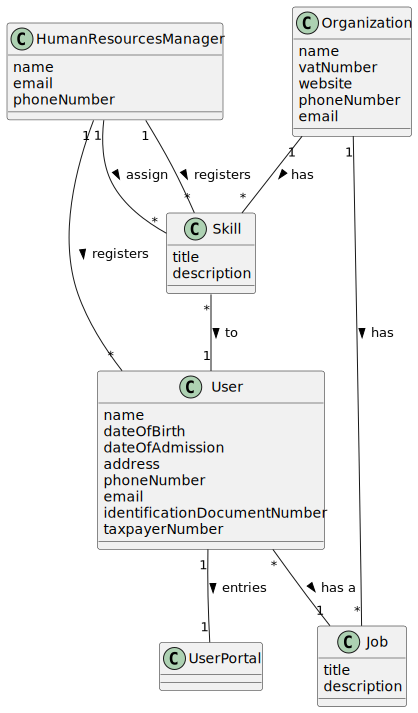

# OO Analysis

The construction process of the domain model is based on the client specifications, especially the nouns (for _concepts_) and verbs (for _relations_) used.

## Rationale to identify domain conceptual classes
To identify domain conceptual classes, start by making a list of candidate conceptual classes inspired by the list of categories suggested in the book "Applying UML and Patterns: An Introduction to Object-Oriented Analysis and Design and Iterative Development".

### _Conceptual Class Category List_

**Business Transactions**

* Team management transactions involve organizing multidisciplinary teams responsible for green space maintenance.
* Allocation transactions handle the assignment of teams to specific green spaces.
---

**Transaction Line Itemss**

* Team allocation line items record the allocation of teams to specific green spaces.

---

**Product/Service related to a Transaction or Transaction Line Item**

* Green space products/services encompass plant material, urban furniture, irrigation systems, and lighting systems.

---

**Transaction Records**

* Team assignment records document the allocation of teams to green spaces.
* Equipment management records track the management of fleet, machines, and equipment.

---  

**Roles of People or Organizations**

* Employee roles include designer, gardener, electrician, etc.

---

**Places**

* Green space locations represent the physical locations of managed green spaces.

---

**Noteworthy Events**

* Property owner contact events signify instances where property owners request maintenance or services.

---

**Physical Objects**

* Equipment comprises vehicles, machines, and equipment used for maintenance.

---

**Descriptions of Things**

* Agenda entry descriptions outline scheduled maintenance tasks.
* Portal feedback descriptions detail user feedback and reports submitted through the Green Spaces User Portal.

---

**Catalogs**

* Property catalogs list available green spaces for maintenance or service.

---

**Containers**

* Team containers hold teams assigned to specific green spaces.

---

**Elements of Containers**

* Team elements represent individual teams within team containers.

---

**Organizations**

* Green space management organizations are responsible for overseeing green space management activities.

---

**Other External/Collaborating Systems**

* The Portal system manages user feedback and reports through the Green Spaces User Portal.

---

**Records of finance, work, contracts, legal matters**

* Finance records track financial transactions related to green space management.
* Contract records document formal agreements with property owners or clients.

---

**Financial Instruments**

* Payment instruments facilitate financial transactions related to green space management.

---

**Documents mentioned/used to perform some work/**

* Agenda documents schedule maintenance tasks.
* Contract documents formalize agreements with property owners or clients.

---

## Rationale to identify associations between conceptual classes

An association is a relationship between instances of objects that indicates a relevant connection and that is worth of remembering, or it is derivable from the List of Common Associations:

- **_A_** is physically or logically part of **_B_**
- **_A_** is physically or logically contained in/on **_B_**
- **_A_** is a description for **_B_**
- **_A_** known/logged/recorded/reported/captured in **_B_**
- **_A_** uses or manages or owns **_B_**
- **_A_** is related with a transaction (item) of **_B_**
- etc.

| Concept (A) 		|    Association   	    |  Concept (B) |
|----------	   		|:---------------------:|------:       |
| Business Transactions  	| allocate resources to | Teams  |
| Transaction Records  	| are logged in    		 	 | Maintenance Logs  |
| Roles of People or Organizations  |    are managed by     |    Human Resources Manager               |
|     Places                  |    are managed by     |     Organization              |
|   Physical Objects                    |      are part of      |      Equipment             |
|    Elements of Containers                                   |    are members of     |   Teams                         |
|     Organizations                                  |        manage         |   Green Spaces                         |
|   Records of finance, work, contracts, legal matters                                    |     are stored in                  |       Database                     |

## Domain Model

