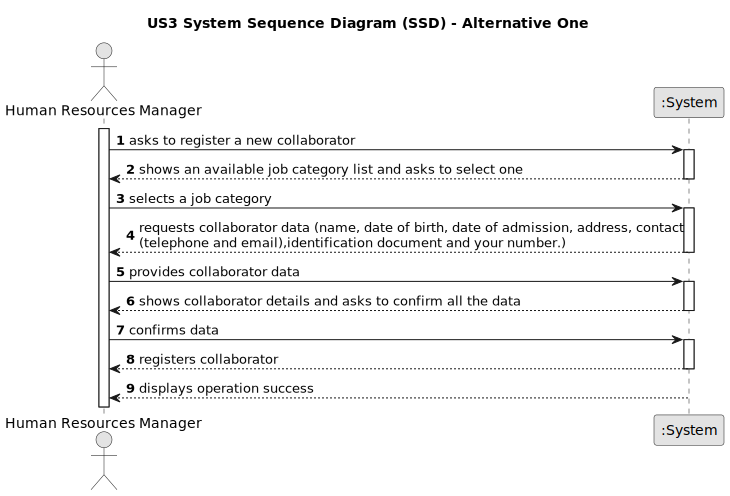

# US 003 - Want to register a collaborator with a job and fundamental characteristics.

## 1. Requirements Engineering

### 1.1. User Story Description

As an HRM, I want to be able to register a collaborator with their assigned job and fundamental characteristics within the organization's system
### 1.2. Customer Specifications and Clarifications

**From the specifications document**

>The HRM needs to input collaborator details, including name, birthdate, admission date, address, contact information (mobile and email), ID document type, and respective number.

>After entering collaborator data, the system should allow the HRM to select the job for the collaborator and assign it.

>The system must generate a random password for each collaborator, which is then sent via email.

>Upon successful registration, the system should display "operation success".### 1.3. Acceptance Criteria

**From the client clarifications**

### 1.3. Acceptance Criteria
- AC1: A password with eight characters, including three capital letters and two digits, is automatically generated and sent by email to the collaborator.
- AC2: The HRM must select the job assigned to the collaborator.
- AC3: The ID document type and number serve as the unique identifier for the collaborator.
- AC4: The HRM must provide the name, birthdate, admission date, address, contact information (mobile and email), ID document type, ID document number, and assigned job for collaborator registration.### 1.4. Found out Dependencies
### 1.4 Found out Dependencies

### 1.5 Input and Output Data

Input Data:

- Typed data:

    - Name of the collaborator
    - Birthdate
    - Admission date
    - Address
    - Contact information (mobile and email)
    - ID document type
    - ID document number
- Selected data:

    - Assigned job for the collaborator
- Output Data:

    - Automatically generated password for the collaborator.
    - Confirmation of the success or failure of the registration operation.
### 1.6. System Sequence Diagram (SSD)

**Other alternatives might exist.**

#### Alternative One

### 1.7 Other Relevant Remarks
