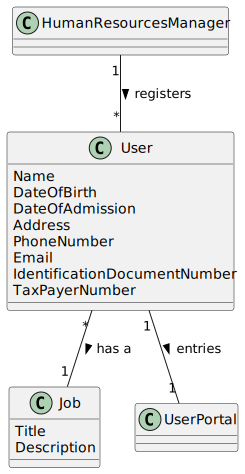

# US 003 - As an HRM, I want to register a collaborator with a job and fundamental characteristics.
## 2. Analysis

### 2.1. Relevant Domain Model Excerpt

### 2.2. Other Remarks

#### Multiplicity and Relationships:

- HRM registers multiple Users.
- Each User has one Job assigned.
- Users interact with the system through the User Portal.
 
#### Attributes:

- User attributes include essential personal and contact information.
- Job attributes define role titles and descriptions.

#### Completeness:

- The diagram covers user registration and job assignment functionalities.

#### Clarity and Readability:

- Clear labeling enhances understanding of system structure and relationships.