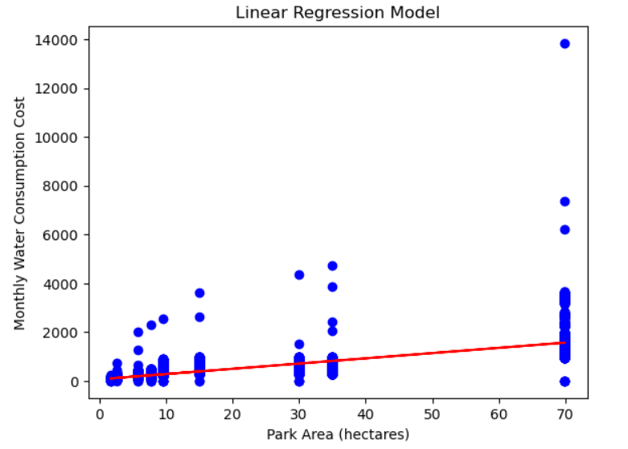
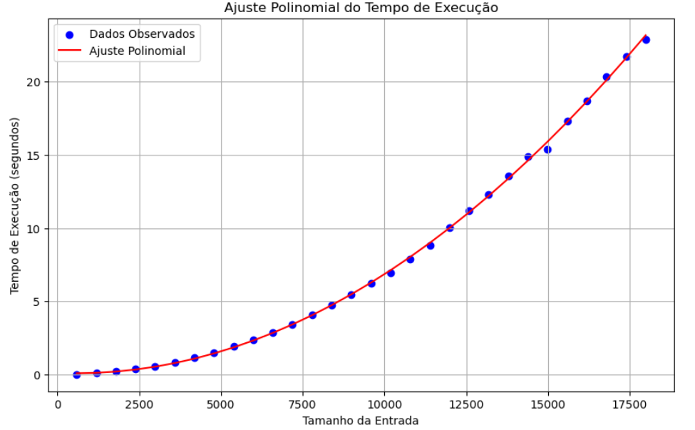

# User Manual: Green Spaces

# Management System

### Team ID: G133

### Team Name: UrbanParkitects

### Students:

- Alexandre Cruz - 1221585
- Kevin Alexandre – 1200542
- João Amorim - 1231635

### Institution: Instituto Superior de Engenharia Do Porto

### Course Unit: Engenharia Informática

### Date: 10/05/20 24

## Introduction

Welcome to the Green Spaces Management System (GSMS) user manual, your
comprehensive guide to mastering the art of urban green space management. This
manual is designed to assist Green Space Managers (GSMs) and other stakeholders in
efficiently managing and maintaining city parks and green spaces. From registering
new gardens to assigning tasks to your team, this guide provides clear, step-by-step
instructions to help you navigate and utilize the system's features effectively.

In today's urban environments, green spaces are essential for enhancing the quality of
life, providing recreational areas, and improving ecological health. As a GSM, your role
in maintaining these urban oases is crucial. Whether you are a seasoned professional
or new to the field, this manual will empower you to manage your responsibilities with
confidence and ease. By leveraging the tools and features provided by the GSMS, you
can ensure that our cities remain vibrant, healthy, and beautiful places for all to enjoy.

Dive into this guide to discover how you can optimize team assignments, streamline
maintenance tasks, and efficiently manage the various aspects of green space upkeep.
Together, we can work towards creating and sustaining greener, more livable urban
spaces.

## System Overview

The Green Spaces Management System (GSMS) is a comprehensive tool crafted to
streamline the planning, construction, and maintenance of urban green spaces. This
system is equipped with a variety of features designed to support Green Space
Managers (GSMs) in their various roles. It enables efficient multidisciplinary team
management, allowing GSMs to allocate teams to specific green spaces based on skill
sets and project requirements.

Additionally, the GSMS facilitates the management of fleets and equipment, ensuring
that all necessary tools are available and properly maintained. The system also
includes advanced features for optimizing irrigation and lighting systems, helping to
conserve resources and enhance the sustainability of green spaces.

Moreover, the GSMS provides powerful capabilities for the production of statistical
indicators, giving GSMs valuable insights into the performance and condition of their
green spaces. These features collectively empower GSMs to enhance operational
efficiency, improve the health and aesthetics of urban green areas, and contribute to
the overall well-being of city residents.

## System Requirements

To ensure the smooth operation of the Green Space Management Application, please
ensure that your system meets the following hardware and software requirements.

**Hardware Requirements**

- **Processor:**
  o Minimum: Intel Core i3 or equivalent
  o Recommended: Intel Core i5 or higher
- **Memory (RAM):**
  o Minimum: 4 GB
  o Recommended: 8 GB or more
- **Disk Space:**
  o Minimum: 500 MB of free disk space for the application
  o Recommended: 1 GB or more to accommodate additional data and logs
- **Display:**
  o Minimum: 1024 x 768 resolution
  o Recommended: 1920 x 1080 resolution or higher

**Software Requirements**

- **Operating System:**
  o Windows 10 or higher (64-bit)
  o macOS 10.15 (Catalina) or higher
  o Linux (Ubuntu 18.04 or higher, or equivalent)
- **Java Development Kit (JDK):**
  o Version: JDK 11 or higher (ensure JAVA_HOME environment variable is
  set to the JDK installation path)
- **JavaFX:**
  o JavaFX SDK version 22.0.1 (must be downloaded and installed
  separately if not included in the JDK)
- **Maven:**
  o Version: Apache Maven 3.6.3 or higher
- **Internet Connection:**
  o Required for downloading dependencies and email notifications.

## Required Plugins

- JavaFX Maven plugin

## Installation Procedure

1. **Java Development Kit (JDK) Installation:**
   o Download the JDK from the official Oracle or OpenJDK website.
   o Follow the installation instructions for your operating system.
   o Set the JAVA_HOME environment variable to the JDK installation path.
2. **JavaFX SDK Installation:**
   o Download the JavaFX SDK from the official OpenJFX website.
   o Extract the SDK to a desired location on your system.
   o Add the JavaFX library to your project dependencies.
3. **Apache Maven Installation:**
   o Download Maven from the official Apache Maven website.
   o Extract the downloaded archive to a preferred location.
   o Add the bin directory of the extracted Maven directory to your system's
   PATH environment variable.
4. **Project Setup:**
   o Clone or download the project repository from your version control
   system.
   o Open the project in your IDE (e.g., IntelliJ IDEA).
   o Ensure the pom.xml file is configured correctly with all required
   dependencies.
   o Refresh Maven dependencies to ensure all required libraries are
   downloaded.
5. **Run the Application:**
   o Use the IDE's built-in Maven support to compile and run the application.
   o Alternatively, use the command line to navigate to the project directory
   and execute.
6. **Configuration Files:**
   o Ensure any required configuration files (e.g., email services, sorting
   algorithms) are properly set up and placed in the correct directory as
   per the project documentation.

**Additional Technical Specifications**

- **Email Services Configuration:**
  o A configuration file should be set up to define different email services
  (e.g., Gmail, DEI’s email service).
- **Sorting Algorithm Configuration:**
  o A configuration file should be set up to define the sorting algorithms for
  listing green spaces.

## System Features (Based on User Stories)

**Feature 1: Register Skills | HRM**

- **Description** : This feature allows Human Resources Managers to register skills
  that collaborators may possess, facilitating skill-based task assignments within
  the organization.
- **Acceptance Criteria** :
    - The system should validate the skill name provided by the HRM,
      ensuring it does not contain special characters or digits.
    - Upon successful registration, the system should display a confirmation
      message to the HRM.
- **Instructions** :
1. Navigate to the "Skills Registration" section of the system.
2. Click on the "Add New Skill" button.
3. Enter the skill name in the designated field.
4. Ensure that the skill name does not contain any special characters or digits.
5. Click "Submit" to register the skill.

**Feature 2: Register Job | HRM**

- **Description** : This feature enables Human Resources Managers to register job
  roles that collaborators need to have within the organization.
- **Acceptance Criteria** :
    - The system should validate the job name provided by the HRM,
      ensuring it does not contain special characters or digits.
    - Upon successful registration, the system should display a confirmation
      message to the HRM.
- **Instructions** :
    1. Go to the "Job Registration" section of the system.
    2. Click on the "Add New Job" button.
    3. Enter the job name in the designated field.
    4. Ensure that the job name does not contain any special characters or
       digits.
    5. Click "Submit" to register the job.

**Feature 3: Register Collaborator with Job and Characteristics | HRM**

- **Description:** This feature allows Human Resources Managers to register
  collaborators with essential details such as name, birth date, admission date,
  contact info, taxpayer number, and ID document information.
- **Acceptance Criteria:**
    - HRMs should provide all required collaborator details, ensuring
      taxpayer identification and citizen card numbers are valid.
    - The system should validate the provided information and display
      relevant error messages if necessary.
- **Instructions:**
1. Navigate to the "Collaborator Registration" section of the system.
2. Fill in the required collaborator details in the designated fields.
3. Ensure that all mandatory fields are filled correctly and provide valid taxpayer
   and citizen card numbers.
4. Click "Submit" to register the collaborator.

**Feature 4: Assign Skills to Collaborator | HRM**

- **Description:** This feature enables Human Resources Managers to assign one or
  more skills to a collaborator, indicating their proficiency in various areas.
- **Acceptance Criteria:**
    - HRMs should select the collaborator and the skills to be assigned from
      predefined lists.
    - The system should confirm successful skill assignment and update the
      collaborator's profile accordingly.
- **Instructions:**
1. Navigate to the "Collaborator Skills Assignment" section of the system.
2. Select the collaborator from the list.
3. Choose the skills to be assigned to the collaborator from the available options.
4. Click "Assign Skills" to complete the process.

**Feature 5: Generate Team Proposal Automatically | HRM**

- **Description:** This feature allows Human Resources Managers to automatically
  generate team proposals based on specified criteria such as maximum and
  minimum team size and required skills.
- **Acceptance Criteria:**
    - HRMs should supply the maximum and minimum team size and a set of
      required skills for team composition.
    - The system should generate team proposals that meet the specified
      criteria and display them for review.
- **Instructions:**
1. Navigate to the "Team Proposal Generation" section of the system.
2. Enter the maximum and minimum team size and specify the required skills for
   the team.
3. Click "Generate Proposal" to automatically generate team proposals.
4. Review the generated proposals and select the most suitable option.

**Feature 6 : Register Green Space | GSM**

- **Description:** This feature allows Green Space Managers (GSM) to register a green
  space, including its type (garden, medium-sized park, large-sized park) and its
  respective area.
- **Acceptance Criteria:**
    - GSMs must be able to specify the type of green space.
    - GSMs must be able to enter the area of the green space.
- **Instructions:**
    1. Navigate to the "Register Green Space" section of the system.
    2. Select the type of green space (garden, medium-sized park, large-sized park).
    3. Enter the area of the green space.
    4. Click "Register" to save the green space details.

**Feature 7 : Add New Entry to To-Do List | GSM**

- **Description:** This feature allows GSMs to add a new entry to the To-Do List
  associated with a managed green space.
- **Acceptance Criteria:**
    - The new entry must be ass
    - ociated with a green space managed by the GSM.
    - The green space for the new entry should be chosen from a list presented to
      the GSM.
- **Instructions:**
    1. Navigate to the "To-Do List" section of the system.
    2. Click "Add New Entry".
    3. Choose the green space from the presented list.
    4. Enter the details of the new entry.
    5. Click "Save" to add the entry to the To-Do List.

**Feature 8 : Add New Entry to Agenda | GSM**

- **Description:** This feature allows GSMs to add a new entry to the Agenda, associating
  it with a managed green space and ensuring it exists in the To-Do List.
- **Acceptance Criteria:**
    - The new entry must be associated with a green space managed by the GSM.
    - The new entry must exist in the To-Do List.
- **Instructions:**
    1. Navigate to the "Agenda" section of the system.
    2. Click "Add New Entry".
    3. Choose the green space from the presented list.
    4. Select the entry from the To-Do List.
    5. Click "Save" to add the entry to the Agenda.

**Feature 9 : Assign Team to Agenda Entry | GSM**

- **Description:** This feature allows GSMs to assign a Team to an entry in the Agenda
  and send a notification to all team members.
- **Acceptance Criteria:**
    - A message must be sent to all team members informing them about the
      assignment.
    - Different email services can send the message, defined through a configuration
      file to allow the use of different platforms (e.g., Gmail, DEI’s email service).
- **Instructions:**
    1. Navigate to the "Agenda" section of the system.
    2. Select the entry to which you want to assign a team.
    3. Choose the team from the list.
    4. Click "Assign Team".
    5. Ensure that team members receive the notification as per the configured email
       service.

**Feature 10 : List All Managed Green Spaces | GSM**

- **Description:** This feature allows GSMs to list all green spaces they manage, sorted by
  size in descending order.
- **Acceptance Criteria:**
    - The list of green spaces must be sorted by size in descending order.
    - The sorting algorithm must be defined through a configuration file with at least
      two available algorithms.
- **Instructions:**
    1. Navigate to the "Green Spaces" section of the system.
    2. Click "List All Green Spaces".
    3. Review the list sorted by size.
    4. Optionally, configure the sorting algorithm through the configuration file if
       needed.

**Feature 11 : Consult Assigned Tasks | Collaborator**

- **Description:** This feature allows Collaborators to consult the tasks assigned to them
  between two dates and filter the results by task status.
- **Acceptance Criteria:**
    - The list of tasks must be sorted by date.
    - Collaborators should be able to filter the results by the status of the task.
- **Instructions:**
    1. Navigate to the "Assigned Tasks" section of the system.
    2. Enter the start and end dates to filter the tasks.
    3. Click "Search" to view the tasks within the specified date range.
    4. Use the filter options to sort tasks by their status.
    5. Review the filtered task list.

## Troubleshooting

This section includes a list of possible error situations and solutions to help users
identify and solve problems with the application. If you encounter an issue not listed
here, please contact our Helpdesk or Support Centre for assistance.

**Issue 1: Application Won't Start**

- **Symptom:** The application fails to start, and no error message is displayed.
  o **Instructions to Narrow Down:**
  1. Check if the JDK and JavaFX SDK are correctly installed.
  2. Ensure that the JAVA_HOME and PATH environment variables
  are set properly.
  3. Verify if all required dependencies are downloaded.
  o **Solution:** Reinstall JDK and JavaFX SDK, and verify the environment
  variables. Refresh Maven dependencies.
  o **Support:** Contact Helpdesk at support@example.com or call 123- 456 -
  7890.

**Issue 2: Maven Build Fails**

- **Symptom:** Maven build fails with dependency resolution errors.
  o **Instructions to Narrow Down:**
  1. Check if the pom.xml file is configured correctly.
  2. Ensure that you have an active internet connection.
  3. Verify the repository URLs in the pom.xml file.
  o **Solution:** Correct any errors in the pom.xml file and run mvn clean
  install again.
  o **Support:** Contact Helpdesk at support@example.com or call 123- 456 -
  7890.

**Issue 3: Missing JavaFX Library**

- **Symptom:** Errors related to missing JavaFX classes during compilation.
  o **Instructions to Narrow Down:**
  1. Check if the JavaFX SDK is added to the project dependencies.
  2. Verify the JavaFX library path in the project settings.
  o **Solution:** Add the JavaFX SDK to your project dependencies and ensure
  the library path is correct.
  o **Support:** Contact Helpdesk at support@example.com or call 123- 456 -
  7890.

**Issue 4: Email Notifications Not Sent**

- **Symptom:** Team members do not receive email notifications for assignments.
  o **Instructions to Narrow Down:**
  1. Check the email service configuration file.
  2. Verify internet connectivity.
  o **Solution:** Correct the email service configuration and ensure the
  application can access the internet.
  o **Support:** Contact Helpdesk at support@example.com or call 123- 456 -
  7890.

**Issue 5: Sorting Algorithm Not Working**

- **Symptom:** Green spaces are not sorted as expected.
  o **Instructions to Narrow Down:**
  1. Check the sorting algorithm configuration file.
  2. Verify that the correct algorithm is specified in the configuration
  file.
  o **Solution:** Update the configuration file with the correct sorting
  algorithm.
  o **Support:** Contact Helpdesk at support@example.com or call 123- 456 -
  7890.

**Issue 6: Cannot Add New Entry to To-Do List**

- **Symptom:** Adding a new entry to the To-Do List fails.
  o **Instructions to Narrow Down:**
  1. Ensure the green space is selected from the list.
  2. Verify the green space is managed by the GSM.
  o **Solution:** Select a valid green space and try again.
  o **Support:** Contact Helpdesk at support@example.com or call 123- 456 -
  7890.

**Issue 7: Cannot Add New Entry to Agenda**

- **Symptom:** Adding a new entry to the Agenda fails.
  o **Instructions to Narrow Down:**
  1. Ensure the entry exists in the To-Do list.
  2. Verify the green space is managed by the GSM.
  o **Solution:** Add the entry to the To-Do list first and then add it to the
  Agenda.
  o **Support:** Contact Helpdesk at support@example.com or call 123- 456 -
  7890.

**Issue 8: Team Assignment Notification Not Received**

- **Symptom:** Team members do not receive notifications for team assignments.
  o **Instructions to Narrow Down:**
  1. Check the email service configuration.
  2. Ensure the correct email service is used.
  o **Solution:** Update the configuration file with the correct email service
  settings.
  o **Support:** Contact Helpdesk at support@example.com or call 123- 456 -
  7890.

**Issue 9: Cannot Filter Tasks by Status**

- **Symptom:** Task filtering by status does not work.
  o **Instructions to Narrow Down:**
  1. Verify the status filter options in the UI.
  2. Ensure tasks have valid status values.
  o **Solution:** Check and correct the status values of tasks.
  o **Support:** Contact Helpdesk at support@example.com or call 123- 456 -
  7890.

For further assistance, please contact our Helpdesk or Support Centre at
support@example.com or call 123- 456 - 7890.

## Frequently Asked Questions

**Q1: How do I register a new green space in the application?
A1:** Navigate to the "Green Spaces" section and click on "Register New Green Space".
Fill in the required information and save.

**Q2: How can I add a new entry to the To-Do List?
A2:** Go to the "To-Do List" section, select the green space from the list, and click "Add
New Entry". Fill in the details and save.

**Q3: How do I add a new entry to the Agenda?
A3:** Ensure the entry is first added to the To-Do List. Then, navigate to the "Agenda"
section, select the entry from the list, and click "Add to Agenda".

**Q4: How do I assign a team to an entry in the Agenda?
A4:** In the "Agenda" section, select the entry you want to assign a team to, click
"Assign Team", choose the team members, and confirm. A notification will be sent to
all team members.

**Q5: How can I list all green spaces I manage?
A5:** Navigate to the "Green Spaces" section and click on "List All Green Spaces". The list
will be sorted by size in descending order. You can configure the sorting algorithm in
the configuration file if needed.

**Q6: How do I consult tasks assigned to me between two dates?
A6:** Go to the "Assigned Tasks" section, enter the start and end dates, and click
"Search". You can filter the tasks by status using the filter options provided.

## MATCP

### US15:
- **User Story (US15):** This user story involves predicting the average monthly cost for water consumption in a new 55-hectare park managed by a park management company. It utilizes data from "water consumption updated.csv" and "Area.csv" files, which contain daily water consumption and park area information, respectively, as used in a previous user story (US09). The goal is to apply linear regression, with park area as the independent variable and average monthly cost as the response variable, to estimate the cost for the new park.
- **Implementation Steps:**
    1. Utilize data from "water consumption updated.csv" and "Area.csv" files.
    2. Study the feasibility of linear adjustment by analyzing the relationship between park area and average monthly cost.
    3. Apply linear regression model with park area as the independent variable and average monthly cost as the response variable.
    4. Predict the average monthly cost for water consumption in the new 55-hectare park based on the linear regression model.

- Predicted monthly water consumption cost for the new 55-hectare park: 1248.750403605111
- Mean Squared Error: 201194.677324753

### US16:
- **User Story (US16):** This user story involves applying polynomial regression to determine the best line that fits the data obtained from US14 or the data contained in "solution us14.csv", depending on whether the student participated in US14 or not. The goal is to find the polynomial equation that best represents the relationship between the independent and dependent variables, providing insights into the underlying patterns in the data.
- **Implementation Steps:**
    1. Collect the dataset containing the relevant data points from US14 or "solution us14.csv".
    2. Preprocess the dataset for polynomial regression analysis, including handling missing values and feature scaling.
    3. Apply polynomial regression to the preprocessed dataset, choosing an appropriate degree for the polynomial.
    4. Evaluate the performance of the polynomial regression model using appropriate metrics.
    5. Visualize the polynomial regression line along with the original data points to assess the model's fit.
    6. Interpret the results of the polynomial regression analysis, including coefficients of the polynomial equation and goodness-of-fit measures.

- Coeficientes da Regressão Polinomial: [ 0.00000000e+00 -8.70860532e-05  7.60279067e-08]
- Erro Médio Quadrático: 0.022761717007143138
