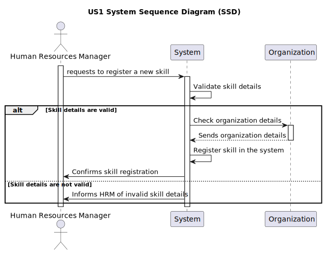

# US 001 - Want to register skills that a collaborator may have.

## 1. Requirements Engineering

### 1.1. User Story Description

As an HRM, I need to register skills for collaborators. This allows me to add new skills to the system and associate them with collaborators as needed.

**From the specifications document**

>The HRM should be able to register new skills for collaborators.

>Upon submission, the system should validate the provided skill details to ensure they meet the required format and criteria.

>Successful validation prompts the system to create the new skill, enabling its association with collaborators.

>Confirmation of successful skill registration, along with relevant identification details, is provided to the HRM.

**From the client clarifications**

> **Question:** What criteria are needed to register a skill?
>
> **Answer:** the name of the skill, for example: pruner, heavy vehicle driver, phytopharmaceutical applicator

> **Question:** When a skill is created that already exists, what should the system do?
>
> **Answer:** By definition it is not possible to have duplicate values ​​in a set. Checking for duplicates is not a business rule, it is a technological one.

> **Question:** Do I need to add skills  by writing them or can I just give a file with all of the skills?
>
> **Answer:** Both are acceptable since the business the same the crucial difference resides in the UX.

> **Question:** Does the HRM need to see the confirmation of the sucess of the operation and the skills added or just the sucess of the operation?
>
> **Answer:** It will depend if you opt to insert one skil or a set of skils in a batch. Maybe some adaptation needed.

> **Question:** Is there any other possible outcome like if the HMR does not put the requested data, do I need to ask the user to to register a diferent competence?
>
> **Answer:** This US is quite simple, atm a skill is simply a name.

> **Question:** Which information can be introduced to create a new skill?
>
> **Answer:** The skill name;

> **Question:** Which information is mandatory for creating a new skill?
>
> **Answer:** The skill name;

> **Question:** Which are the skills accepted? Or should we enable the HRM to introduce anything as a skill?
>
> **Answer:** All, it's up to HRM to decide. (special characters or algarisms should not be allowed in the skill name)

> **Question:** Should the system able the HRM to introduce multiple skills in one interaction before saving all of them?
>
> **Answer:** it's not required to do so.

> **Question:** The indentificator of the skill will be the name, or the system will generate authomatically and Id when the manager insert the name?
>
> **Answer:** A skill is just a name, can be a composition os words like "Light Vehicle Driving Licence".I have no knowledge about systems IDs.

### 1.3. Acceptance Criteria
- AC1: The system should successfully register a new skill based on the provided skill name.
- AC2: Duplicate skill names should not be allowed, ensuring uniqueness.
- AC3: The HRM should receive confirmation of the successful operation, either for individual skill registration or batch registration.
### 1.4 Found out Dependencies

- The system depends on the HRM to provide accurate and valid skill names for registration.
- The system should handle input data validation to ensure it meets required criteria before proceeding with skill registration.

### 1.5 Input and Output Data

Input Data:

- Skill name

Output Data:

- Confirmation of successful skill registration

### 1.6. System Sequence Diagram (SSD)

**Other alternatives might exist.**

#### Alternative One

### 1.7 Other Relevant Remarks

- The system should facilitate both manual entry and batch upload options for skill registration, providing flexibility to the HRM.
- Skill names should adhere to certain criteria, such as disallowing special characters or numerals.
- The HRM's interaction with the system should be user-friendly, regardless of whether skills are registered individually or in batches.

