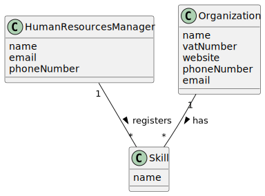

# US 001 - As a Human Resources Manager (HRM), I want to register skills that a collaborator may have.
## 2. Analysis

### 2.1. Relevant Domain Model Excerpt

### 2.2. Other Remarks

#### Multiplicity and Relationships:

- HRM registers multiple skills.
- Each skill can be associated with one or more users.
- Users acquire skills through the HRM's registration process.

#### Attributes:

- Skill attributes include a title and description to describe the skill.
- HRM attributes encompass personal and contact information, facilitating communication and management tasks.

#### Completeness:

- The diagram covers the essential functionalities of skill registration and association with users.

#### Clarity and Readability:

- The diagram is clear and readable, with labeled entities and relationships that enhance understanding of the system's structure and interactions.