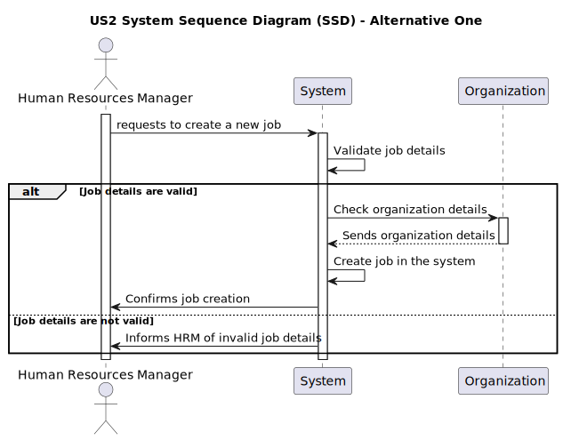

# US 002 - Want to register a job that a collaborator need to have.

## 1. Requirements Engineering

### 1.1. User Story Description

As a Human Resources Manager (HRM), I want to be able to register a new job within the system so that I can define the roles and responsibilities required for specific positions within the organization.

**From the specifications document**

>The HRM should be able to provide the necessary details for the new job, including the job title and any additional descriptions.

>Upon submission, the system should validate the provided information to ensure it meets the required format and criteria.

>If the validation is successful, the system should create the new job and associate it with the organization.

>The HRM should receive confirmation of the successful creation of the job, including any relevant job identification details.

**From the client clarifications**

> **Question:** What are the input data for creating a profession?
>
> **Answer:** The name of the profession: gardener, paver, electrician, driver...

> **Question:** What are the acceptance criteria? When are creating a job that already exit, what the system do?
>
> **Answer:** By definition a set can´t have duplicates. Assuring no duplicates is not a business rule is a tecnichal issue.

> **Question:** Is it relevant to associate a specific area or sector with each Job? (For example, "Gardener" would be placed in the "Maintenance" sector).
>
> **Answer:** it is not necessary as there are no USs that suggest that this might be necessary.

> **Question:** Should information such as salary, type of employment (full-time or part-time), and type of work (in-person, remote or hybrid) be included in the Job? Or does this information fit better within the scope of the employee, or perhaps it is not even necessary?
>
> **Answer:** Same.

> **Question:** What other information do you think is necessary to associate with the Job?
>
> **Answer:** none for now.

> **Question:** Should we add a description or anything atribute for the Job registration?
>
> **Answer:** not need to, job is just a name;

> **Question:** The id of Job is generated authomatically by the system?
>
> **Answer:** don't know what is job id, job is just a name;

> **Question:** I guess a job can be asign to a collaborator if he has the skills require for this job. How do we manage this relation. Does he HRM do it manually, or should we have an atribute in job specifiying the skills needed.
>
> **Answer:** no; a colaborator is hired for a job and can have skills or not;

> **Question:** Do the job has to be register before registering a collaborator?
>
> **Answer:** a colaborator is hired for a (valid) job;

> **Question:** What do you want to see as an output?
>
> **Answer:** the UX/UI is to be decided by dev team.

### 1.3. Acceptance Criteria
- AC1: The system should allow the Human Resources Manager (HRM) to input the name of the profession when creating a new job.
- AC2: Upon submission, the system should verify that the provided profession name is unique, preventing duplicates.
- AC3: If the profession name is unique, the system should create the new job without any additional attributes or descriptions.
- AC4: If the profession name already exists, the system should inform the HRM that the job already exists and no duplicate jobs are allowed.
- AC5: No additional attributes or descriptions are necessary for the job registration process.
### 1.4 Found out Dependencies

- The job registration process is dependent on the input of the profession name by the HRM.
- The system's validation of the uniqueness of the profession name depends on the comparison with existing job records in the system.

### 1.5 Input and Output Data

Input Data:

- Name of the profession (e.g., gardener, paver, electrician, driver).

Output Data:

- Confirmation message indicating successful job creation.
- Error message if the profession name already exists.
### 1.6. System Sequence Diagram (SSD)

**Other alternatives might exist.**

#### Alternative One

### 1.7 Other Relevant Remarks

- The job registration process focuses solely on the name of the profession, as clarified by the client.
- No additional attributes or descriptions are needed for job registration.

