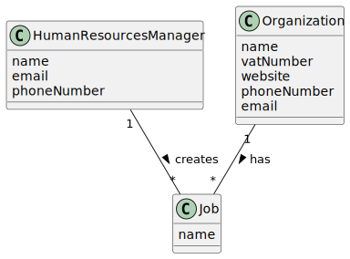

# US 002 - As an HRM, I want to register a job that a collaborator need to have.
## 2. Analysis

### 2.1. Relevant Domain Model Excerpt

### 2.2. Other Remarks

#### Multiplicity and Relationships:

- The Human Resources Manager (HRM) is responsible for creating multiple Jobs.
- Each Job is associated with one Organization.
- The HRM interacts with the system to manage the creation and assignment of Jobs.

#### Attributes:

- The HRM entity encompasses attributes such as name, email, and phone number.
- Jobs are defined by their title/name attribute.

#### Comprehensive Coverage:

- The domain model adequately represents the process of job creation and management within the organization.

#### Clarity and Readability:

- The diagram is clearly labeled, facilitating understanding of the relationships between entities and their attributes.