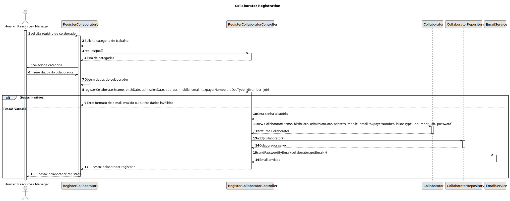
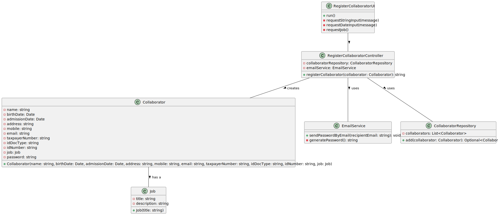

## 3. Design - User Story Realization

### 3.1. Rationale

**The rationale grounds on the SSD interactions and the identified input/output data.**

| Interaction ID | Question: Which class is responsible for... | Answer  | Justification (with patterns)  |
|:---------------|:--------------------- |:------------|:---------------------------- |
| Step 1  		     |	Solicitar registro de colaborador						 |  RegisterCollaboratorUI           | UI class responsible for user interaction.                             |
| Step 2  		     |	Requisitar categoria de trabalho						 |  RegisterCollaboratorUI           | UI class, as it interacts directly with the user to gather input.                            |
| Step 3  		     |	Obter lista de categorias de trabalho						 | RegisterCollaboratorController            | Controller class, which handles business logic, including retrieving job categories.                             |
| Step 4  		     |	Selecionar categoria de trabalho						 | Human Resources Manager            | Conceptual class representing the user role responsible for selecting the job category.                             |
| Step 5  		     |	Inserir dados do colaborador						 | Human Resources Manager            | Conceptual class representing the user role responsible for entering collaborator data.                             |
| Step 6  		     |	Obter dados do colaborador						 | RegisterCollaboratorUI            | UI class, responsible for interacting with the user to obtain collaborator data.                             |              
| Step 7  		     |	Registrar colaborador						 | RegisterCollaboratorController            | Controller class responsible for coordinating the registration process.                             |
| Step 8  		     |	Gerar senha aleatória						 |  RegisterCollaboratorController           |  Controller class responsible for generating the password.                            |
| Step 9  		     |	Criar novo colaborador						 |  Collaborator           |  Conceptual class representing the collaborator entity.                            |
| Step 10  		    |	Salvar colaborador						 | CollaboratorRepository            | Pure Fabrication class responsible for managing the storage and retrieval of collaborators.                             |  
| Step 11        | Enviar e-mail com senha                         | EmailService            |  Pure Fabrication class responsible for the email functionality.                            |
| Step 12        | Confirmar registro do colaborador                         | RegisterCollaboratorUI            | UI class, responsible for confirming the registration with the user.                             |

### Systematization ##

According to the taken rationale, the conceptual classes promoted to software classes are:

* Collaborator
* Human Resources Manager
* EmailService

Other software classes (i.e. Pure Fabrication) identified:

* RegisterCollaboratorUI
* RegisterCollaboratorController
* CollaboratorRepository

## 3.2. Sequence Diagram (SD)

_In this section, it is suggested to present an UML dynamic view representing the sequence of interactions between software objects that allows to fulfill the requirements._

## 3.3. Class Diagram (CD)

_In this section, it is suggested to present an UML static view representing the main related software classes that are involved in fulfilling the requirements as well as their relations, attributes and methods._

