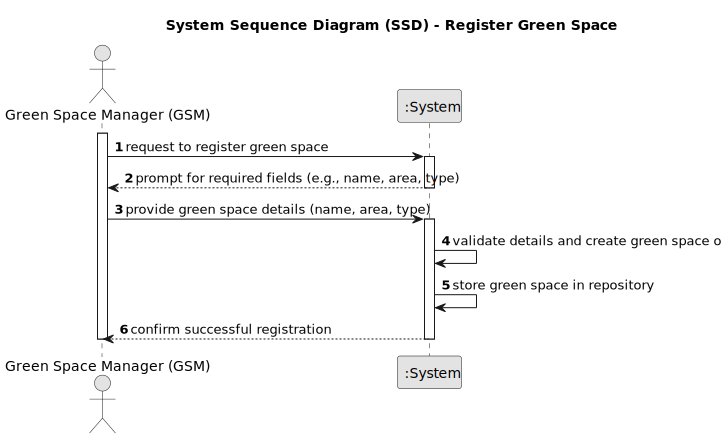

# US020 - Register a Green Space
## 1. Requirements Engineering
### 1.1. User Story Description
As a Green Space Manager (GSM), I want to register a green
space (garden, medium-sized park or large-sized park) and its respective
area.
### 1.2. Customer Specifications and Clarifications
**From the specifications document**
>### Types of Green Spaces and Their Equipment
>
>**Garden:**
>- Space with or without trees.
>- Minimal or no equipment.
>- May have a basic irrigation system and/or benches.
>
>**Medium-sized park:**
>- Green space with a few hundred or thousands of square meters.
>- Wooded garden area.
>- Includes infrastructures such as toilets, drinking fountains, irrigation system, lighting, and children's playground.
>- Examples: Jardim d’Arca de Água.
>
>**Large-sized park:**
>- Multi-functional space with diverse garden spaces and woods.
>- Includes varied equipment and services.
>- Examples: Parque da Cidade.
>
**From the client clarifications**
> **Question:** In the registration of a green space, should a green space's name be allowed to contain digits and special characters, or just letters and whitespaces?
>
> **Answer:** Same rules for other names in the business, letters, spaces and dashes.

> **Question:** Good afternoon, I would like to know between what ranges of hectares a green space is classified as garden, medium or large, or if it is possible to register 2 green spaces with the same area but in different typology, depending on the GSM it registers.
>
> **Answer:**  The classification is not automatic, it's up to GSM decide about it.

> **Question:** Can two green spaces have the same name?
>
> **Answer:** No.

### 1.3. Acceptance Criteria
* **AC1:** As a Green Space Manager (GSM), I should be able to register a green space (garden, medium-sized park, or large-sized park) by providing its name, area, and type so that it is stored in the system for future management and reference.
### 1.4. Found out Dependencies

### 1.5 Input and Output Data

**Input Data:**
* Typed data:
    * Name of the green space.
    * Area of the green space in square meters.
* Selected data:
    * Type of green space (Garden, Medium-sized park, Large-sized park).
      **Output Data:**
* Confirmation message of successful green space registration.
* List of all registered green spaces with details (name, area, type).
### 1.6. System Sequence Diagram (SSD)

### 1.7 Other Relevant Remarks
* The ability to list all added green areas, along with their details, is crucial for effective management of green spaces.
* The system should provide appropriate feedback to the user after successfully adding a green area, ensuring a positive user experience.