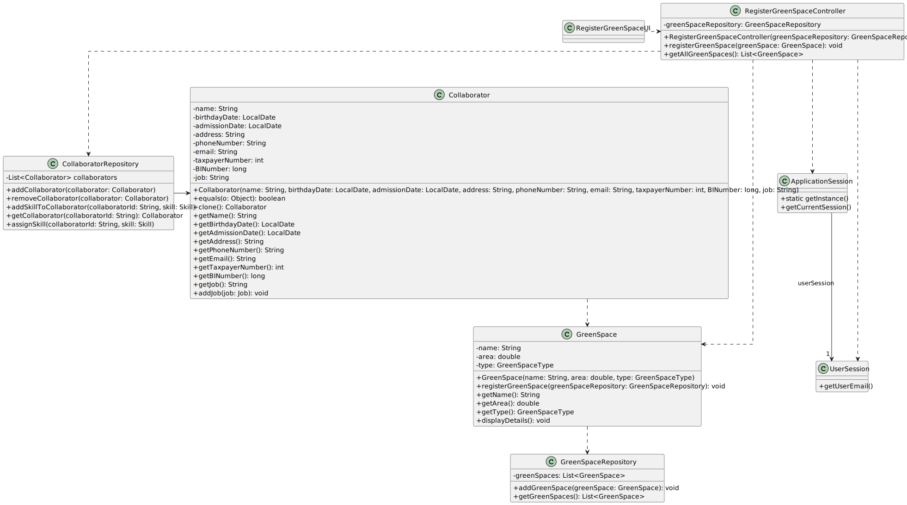

# US020 - Register a Green Space

### 3.1. Rationale
| Interaction ID | Question: Which class is responsible for... | Answer | Justification (with patterns) |
| --- | --- | --- | --- |
| Step 1 | ... interacting with the actor? | RegisterGreenSpaceUI | Pure Fabrication: no existing class in the Domain Model directly interacts with the actor. |
| Step 2 | ... requests to register green space? | RegisterGreenSpaceUI | Controller (High Cohesion, Low Coupling): RegisterGreenSpaceUI initiates the registration process. |
| Step 3 | ... prompting for required fields? | RegisterGreenSpaceUI | Controller (High Cohesion, Low Coupling): RegisterGreenSpaceUI interacts with the user to gather necessary information. |
| Step 4 | ... providing green space details? | RegisterGreenSpaceUI | Controller (High Cohesion, Low Coupling): RegisterGreenSpaceUI collects and passes green space details to the system. |
| Step 5 | ... getting instance of repository? | RepositorySingleton | Creator (High Cohesion): RepositorySingleton is responsible for creating an instance of the repository. |
| Step 6 | ... getting instance of green space repository? | GreenSpaceRepository | Factory (High Cohesion, Low Coupling): GreenSpaceRepository is responsible for creating an instance of the green space repository. |
| Step 7 | ... getting instance of application session? | ApplicationSession | Factory (High Cohesion, Low Coupling): ApplicationSession is responsible for creating an instance of the application session. |
| Step 8 | ... getting current session? | ApplicationSession | Repository (High Cohesion, Low Coupling): ApplicationSession is responsible for retrieving the current session. |
| Step 9 | ... getting user email? | UserSession | Repository (High Cohesion, Low Coupling): UserSession is responsible for retrieving the user's email. |
| Step 10 | ... creating new green space object? | GreenSpace | Creator (High Cohesion): GreenSpace is responsible for creating a new green space object based on the provided details. |
| Step 11 | ... validating green space details? | GreenSpace | Controller (High Cohesion, Low Coupling): GreenSpace validates the provided details. |
| Step 12 | ... storing green space in repository? | GreenSpaceRepository | Repository (High Cohesion, Low Coupling): GreenSpaceRepository handles storing green space objects, reducing coupling with other classes. |
| Step 13 | ... confirming successful registration? | RegisterGreenSpaceUI | Controller (Polymorphism, Protected Variations): RegisterGreenSpaceUI confirms the successful registration to the actor. |
| Step 14 | ... informing actor of successful registration? | RegisterGreenSpaceUI | Controller (Polymorphism, Protected Variations): RegisterGreenSpaceUI informs the actor that the registration was successful. |
### Systematization ##

According to the taken rationale, the conceptual classes promoted to software classes are:

* GreenSpace
* GreenSpaceRepository

Other software classes (i.e. Pure Fabrication) identified:

* RegisterGreenSpaceUI
* RegisterGreenSpaceController

## 3.2. Sequence Diagram (SD)

_**Note that SSD - Alternative Two is adopted.**_

### Full Diagram

This diagram shows the full sequence of interactions between the classes involved in the realization of this user story.

### Split Diagrams

The following diagram shows the same sequence of interactions between the classes involved in the realization of this user story, but it is split in partial diagrams to better illustrate the interactions between the classes.

It uses Interaction Occurrence (a.k.a. Interaction Use).

## 3.3. Class Diagram (CD)

