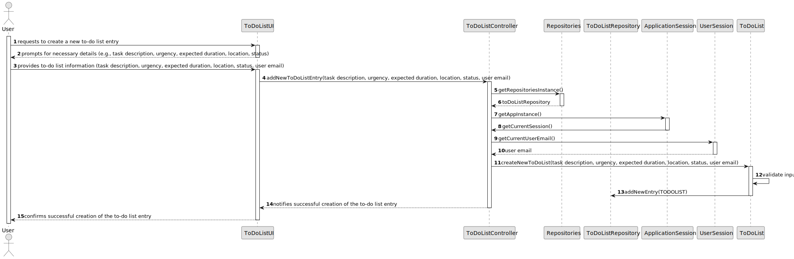

# US021 - Add a Entry to a to-do-List

## 3. Design - User Story Realization

### 3.1. Rationale

| Interaction ID                                                                         | Question: Which class is responsible for...                    | Answer               | Justification (with patterns)                                                                                      |
|:---------------------------------------------------------------------------------------|:---------------------------------------------------------------|:---------------------|:-------------------------------------------------------------------------------------------------------------------|
| Step 1                                                                                 | ...interacting with the actor?                                 | ToDoListUI           | "Pure Fabrication: there is no reason to assign this responsibility to any existing class in the Domain Model.      |
| Step 2 - Requests data                                                                 | ...solicitar os dados do utilizador?                           | ToDoListUI           | IE: responsible for interactions with the user.                                                                       |
| Step 3 - Provides requested data                                                       | ...temporarily keeping the inputted data?                      | ToDoListUI           | IE: responsible for temporarily holding the entered data until the actor confirms it.                           |
| Step 4 - Requests selection of a green space                                           | ...displaying the list of green spaces for selection?          | ToDoListUI           | IE: responsible for displaying the information before submission.                                                     |
| Step 5 - Selects a green space                                                         | ...validating and processing the input data?                   | ToDoListController   | Controller: responsible for coordinating the input creation process, interacting with the UI and the repository.        |
|                                                                                        | ...saving the new to-do list entry?                            | ToDoListRepository   | IE: responsible for storing all entries in the task list.                                               |
| Step 6 - Display operation success                                                     | ...informing operation success?                                | ToDoListUI           | IE: responsible for interactions with the user.                                                                      |

### Systematization

According to the taken rationale, the conceptual classes promoted to software classes are:

* ToDoList

Other software classes (i.e. Pure Fabrication) identified:

* ToDoListUI
* ToDoListController

## 3.2. Sequence Diagram (SD)

## 3.3. Class Diagram (CD)

